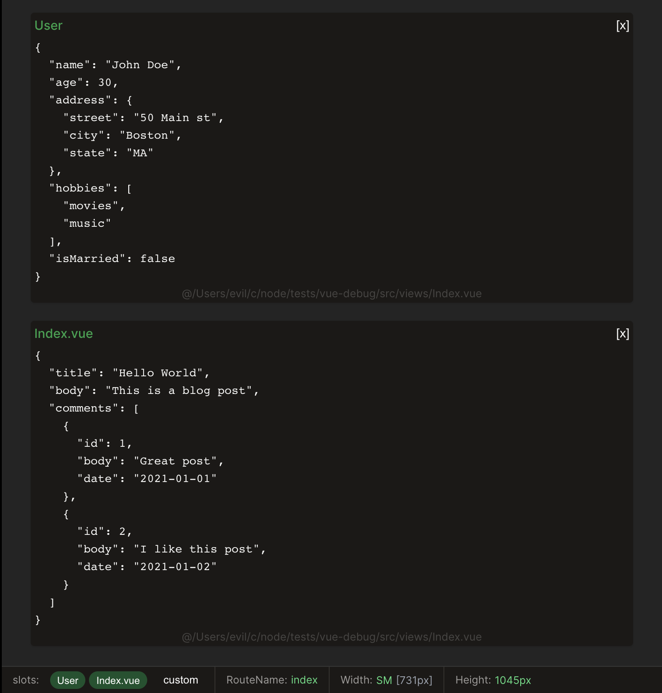

# Vue-json-debug

**STAGE:** [RFC]



A simple Vue component to display JSON data in multiple components.

- Reactive Preview
- Show/Hide Debug Components
- Dev only (not included in production builds)

## Installation

```bash
npm install vue-json-debug
# OR
yarn add vue-json-debug
```

## Usage

```ts
import {createApp} from 'vue';
import App from './App.vue';

// Import plugin
import {useDebugPlugin} from 'vue-json-debug/src/plugin';
// Import plugin styles
import 'vue-json-debug/src/debug.css';

const app = createApp(App);

useDebugPlugin(app, {
    // Register the `<debug>` component globally
    registerDebugComponent: true,
});

app.mount('#app');
```

### Add DebugDock to your app
In order to have the debug dock show up, you need to add the `<debug-dock>` component to your app.

It should be placed in your root component, or in a component that is always visible.

```vue
<template>
    ... your app template
    <debug-dock/>
</template>
```

### Debug Component
 The `<debug>` component is used to display the JSON data. It can be used anywhere in your app.

```vue

<script setup lang="ts">
import {ref} from "vue";

const form = ref({foo: 'bar'});
</script>

<template>
  <debug :data="{form}"/>
</template>
```


## Options

```ts
type DebugPluginOptions = {
    enableIf: () => boolean;
    dock: {
        hideIfNoSlots?: boolean;
        slotTitleLimit?: number;
    };
    defaultDebugTheme: string;
    registerDebugComponent: boolean;
    components?: {
        before?: Record<string, Component>;
        after?: Record<string, Component>;
    };
};
```

| Option                 | Type            | Default      | Description                                                                                                                                |
|------------------------|-----------------|--------------|--------------------------------------------------------------------------------------------------------------------------------------------|
| enableIf               | `() => boolean` | `() => true` | A function that returns a boolean to enable/disable the plugin.                                                                            | 
| dock                   | `Object`        |              | An object that contains the dock options.                                                                                                  |
| dock.hideIfNoSlots     | `boolean`       | `false`      | If `true` the dock will be hidden if there are no slots to display. If you want the dock to be always visible, set this option to `false`. |
| dock.slotTitleLimit    | `number`        | `20`         | The maximum number of characters to display in the slot title before truncating it.                                                        |
| defaultDebugTheme      | `string`        | `dark`       | The default theme to use for the debug component. You can use the following values: `light`, `dark`.                                       |
| registerDebugComponent | `boolean`       | `false`      | If `true` the `<debug>` component will be registered globally.                                                                             |
| components             | `Object`        |              | An object that contains the components to register globally. This provides a way to add more components to the debug component.            |
| components.before      | `Object`        |              | An object that contains the components to register before the default components.                                                          |
| components.after       | `Object`        |              | An object that contains the components to register after the default components.                                                           |


## Debug Component Props
```ts
type DebugProps = {
    data: object;
    forceShow?: boolean;
    space?: number;
    name?: string;
    hideName?: boolean;
    hideFirst: boolean;
    theme?: string;
    useParentName?: boolean;
};
```

| Prop          | Type      | Default | Description                                                                                         |
|---------------|-----------|---------|-----------------------------------------------------------------------------------------------------|
| data          | `object`  |         | The data to display.                                                                                |
| forceShow     | `boolean` | `false` | If `true` the debug component will be shown no matter what.                                         |
| space         | `number`  | `2`     | The number of spaces to use for JSON indentation.                                                   |
| name          | `string`  |         | The name to display.                                                                                |
| hideName      | `boolean` | `false` | If `true` the name will be hidden.                                                                  |
| hideFirst     | `boolean` | `false` | If `true` it will be hidden before mount.                                                           |
| theme         | `string`  |         | The theme to use for the debug component.                                                           |
| useParentName | `boolean` | `false` | If `true` the name of the parent file where the debug component is called from will be used as name |

## Available Dock Components

- `RouteInfo` - Displays the current route name. (Requires [vue-router](https://router.vuejs.org/))
- `ScreenSize` - Displays the current screen width and height. (Requires [@vueuse/core](https://vueuse.org/guide/))

## Registering Components
The Docker supports registering components before and after the default components. This provides a way to add more components to the debug component.

```ts
import RouterInfo from "vue-json-debug/src/docks/RouterInfo.vue";
import ScreenSize from "vue-json-debug/src/docks/ScreenSize.vue";

useDebugPlugin(app, {
    components: {
        after: {RouterInfo, ScreenSize},
    },
});
```


## Nuxt 3 Implementation
To add this package to nuxt, you need to create a plugin.
A nuxt plugin gives you the vue `app` instance.

```ts
export default defineNuxtPlugin((nuxtApp) => {
    const app = nuxtApp.vueApp;
    
    useDebugPlugin(app, {
        registerDebugComponent: true,
    });
});
```

Add the plugin and styles to your `nuxt.config.ts` file.

```ts
export default defineNuxtConfig({
    css: [
        // ... your other styles
        'vue-json-debug/src/debug.css'
    ],
    plugins: [
        // ... your other plugins
        {
            src: '@/plugins/path/to/your/plugin.ts',
            mode: 'client'
        }
    ],
});
```

Add DebugDock to your app just like in the Vue example.
But surrounded by a `<client-only>` component.
```vue

<template>
  <client-only>
    <debug-dock/>
  </client-only>
</template>
```
